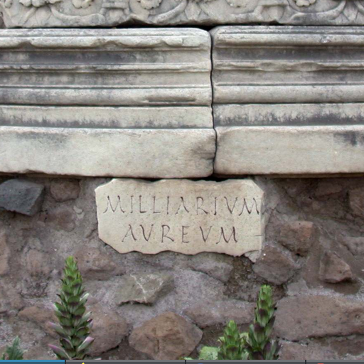

# Roadster: Distance to Closest Road Feature Server



_Milliarium Aerum, the zero of all Roman roads_

This is a feature server that computes the distance to the closest road as feature for a given coordinate.

It can be used command-line or with the provided Flask microframework server.

Roadster uses .SHP files from the [Open Street Map](https://www.openstreetmap.org/) project, as generously provided by [Geofabrik GmbH](https://download.geofabrik.de/).

It can provide the value of the distance-to-closest-road feature for a given coordinate or compute the value of the feature for all points on a given tile. If a given tile is too big, it can sample the feature and interpolate its value using [Ordinary Kriging](https://geostat-framework.readthedocs.io/projects/pykrige/en/stable/index.html).

*No pandas dependencies.*


## Installation

```bash
python setup.py install
```

Download the SHP files and put them (in .zip format) in the `download/` folder.


## Command-line

`roadster-one-tile -m {map-prefix} -l {road_layer} -r {road_type} -z -w {tile-width} -h {tile-height} -o output_file -t {brute|kriging} -b {boost} west-north-gps-lat west-north-gps-long west-north-gps-lat east-south-gps-long`

`roadster-one-coord -m {map-prefix} -l {road_layer} -r {road_type} gps-lat gps-long`

Arguments:

* Map prefix, e.g., `malta-latest-free`, the `.shp.zip` extension is added. This file is searched for in `download` folder. If the parameter contains a file path, the file is used verbatim (and needs to include the extension).
* Layer that contains the roads by default the first layer is used (which most probably do not contain the roads).
* Type of roads (e.g., 'primary'), by default use all roads.
* Set the roads distance to zero (otherwise is set to 1).
* Tile width and heights, in pixels.
* Output file, contains the extension, any of the formats understood by scikit-image.
* Type of computation of the tile, either brute force (distance computed for each pixel) or ordinary Kriging interpolation. If not specified, brute-force is used for tiles up to 128x128 pixels.
* Boost to the signal, defaults to 1000.0, try smaller numbers is the image is all white.


### Finding the layer with roads

Use the provided command `list-layers -m {map-prefix}`.


## API

```python
import roadster

mapdata = roadster.data.load_map('prince-edward-island-latest-free', 11, set(['primary'])) # major roads
featdist = roadster.point.distance(mapdata, (-63.1293, 46.2905)) # long/lat
# ... use feature as needed ...
img = roadster.data.create_image(128, 128)
roadster.tile.plot(img, mapdata, 'brute', (-63.1647, 46.2779), (-63.0914, 46.2329), boost=10)
roadster.data.plot_roads(img, mapdata, (-63.1647, 46.2779), (-63.0914, 46.2329), road_value=1.0)
# ... use image as needed ...
roadster.data.save_image(img, "pei.png")
```

This computes a feature tile at this location: https://osm.org/go/cgtSeJX

The output tile looks like this:


## Server

The Flask server takes similar parameters as the command-line interfaces. It caches the map data between calls.

```bash
flask run &
curl --output pei.png http://localhost:5000/tile/prince-edward-island-latest-free/11/128/128/46.2779/-63.1647/46.2329/-63.0914?zero_roads\&road_type=primary\&boost=10\&type=kriging
curl http://localhost:5000/point/prince-edward-island-latest-free/11/46.2779/-63.1647
```


## Roadmap

* Handle downloading and caching OSM street data
* Better sampling for Kriging


## Known issues

* The tool takes the coordinates in lon/lat format as that seems to be the format present in OSM
* On larger tiles, there are some projection issues that need to be debugged
* Truly large tiles (2048x2048) need 50Gb or more RAM to process
* Brute force does not use multiprocessing


## Contributing

Pull requests are welcome! If you find Roadster useful, feel free to contribute. This codebase uses `black` for code formatting, please run it on your files before submitting them.


## Acknowledgements

This project started at the #CleanMaltaAI hackathon as part of the [Presagis](https://presagis.com) team.


## Citing

This code expands on [Chapter 10: Other domains Video, geographic information and preferences](http://artoffeatureengineering.com/book.html) of [The Art of Feature Engineering](http://artoffeatureengineering.com). If you use this featurizer in your work, please cite:

```bibtex
@book{duboue2020art,
  title={The Art of Feature Engineering: Essentials for Machine Learning},
  author={Duboue, Pablo},
  year={2020},
  month={June},
  isbn={978-1108709385},
  publisher={Cambridge University Press},
  url={http://artoffeatureengineering.com}
}
```
